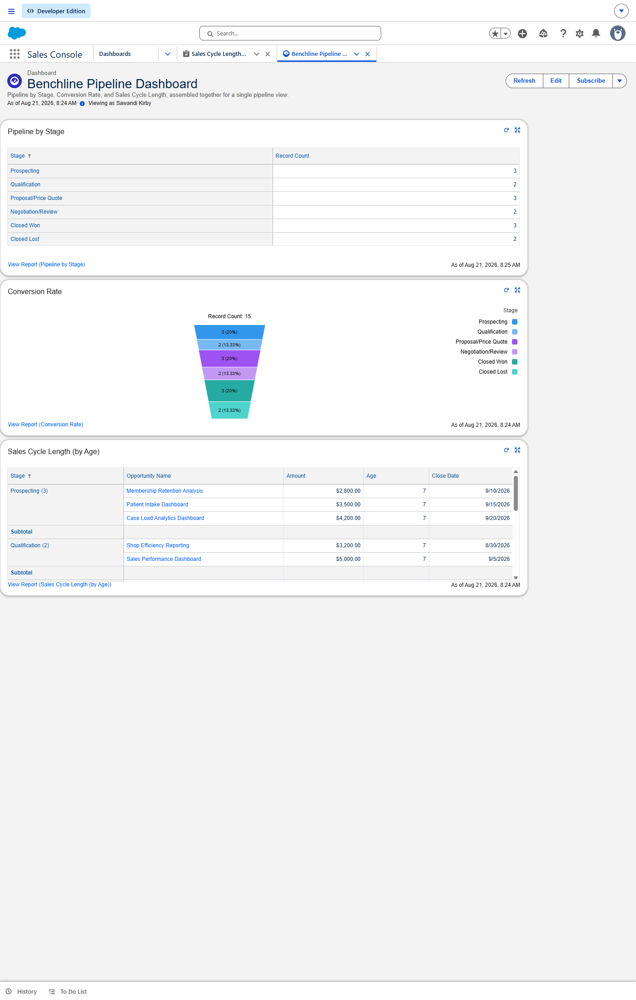

# Salesforce CRM Pipeline Analytics

**Salesforce Sales Cloud | CRM Administration | Reports & Dashboards**

A Salesforce Sales Cloud build modeling Benchline Analytics' own client-acquisition pipeline: 10 synthetic small-business prospects across medical, home-services, professional-services, and retail verticals, tracked through a full sales cycle from Prospecting to Closed Won or Lost. Reports, a dashboard, and one automation Flow sit on top of that data, all built at the CRM admin/analyst level rather than the developer level.

> **In progress:** the second Salesforce superbadge for this skill area (Dashboard Insights for Agentforce Readiness) hasn't been earned yet. This repo stays private until that's done.

---

# Project Overview

Every consulting business runs its own sales pipeline, and Benchline Analytics is no exception: prospects come in, get qualified, get quoted, and either close or fall through. This project uses that real workflow as the business case instead of Salesforce's stock demo accounts (GenePoint, Edge Communications, and the rest) — the 10 prospect accounts here are synthetic small businesses standing in for the kind of client Benchline actually targets, and each Opportunity is a specific analytics deliverable being pitched to that client (a patient-retention dashboard for a dental practice, a job-costing report for a roofing company, and so on).

---

# What's Inside

### 1️⃣ Pipeline Data Model
10 Accounts and Contacts spanning Brightline Orthodontics, Fairview Family Dental, Harborview Physical Therapy, Crestwood Veterinary Clinic, Sterling Roofing Co., Lakeside Landscaping Co., Northgate Auto Repair, Vantage Point Consulting, Thornwood Legal Services, Union Street Bookkeeping, Maple & Co. Bakery, Copperfield Home Goods, Bellmont Fitness Studio, Ridgeline Property Management, and Riverside Dental Group. 15 Opportunities tied to those accounts, spanning every stage from Prospecting through Closed Won/Lost.

### 2️⃣ Reports
Three standard reports, each scoped to just this synthetic pipeline (not the org's built-in demo accounts):
- **Pipeline by Stage** — opportunity count grouped by stage
- **Conversion Rate** — funnel view of the same stages as a percentage of total pipeline
- **Sales Cycle Length (by Age)** — every open and closed opportunity broken out by stage, with deal amount and days-in-stage

### 3️⃣ Dashboard
**Benchline Pipeline Dashboard** — all three reports assembled into one view.

### 4️⃣ Automation
**Opportunity Stage Change Follow-Up** — an Autolaunched Flow triggered on Opportunity stage changes.

---

# Key Metrics

| Stage | Opportunities |
|---|---|
| Prospecting | 3 |
| Qualification | 2 |
| Proposal/Price Quote | 3 |
| Negotiation/Review | 2 |
| Closed Won | 3 |
| Closed Lost | 2 |

15 total opportunities across 10 prospect accounts, all reported directly from the Pipeline by Stage report above.

---

# Tools Used

- Salesforce Sales Cloud (Developer Edition)
- Custom Reports and Report Types
- Dashboards
- Flow Builder (Autolaunched Flow)

---

# Credits

Built on a Salesforce Developer Edition org provisioned through Trailhead. The org ships with Salesforce's own standard demo accounts (Ursa Major Solar-style sample data) alongside the synthetic pipeline documented here — the reports and dashboard in this repo are scoped to exclude that stock data.

---

# Author

**Sawandi Kirby**

Data Analytics & Business Intelligence
Benchline Analytics - Data intelligence for organizations that mean business.

- GitHub: https://github.com/visualkirby
- LinkedIn: https://linkedin.com/in/sawandi-kirby
- Kaggle: https://kaggle.com/sawandikirby
